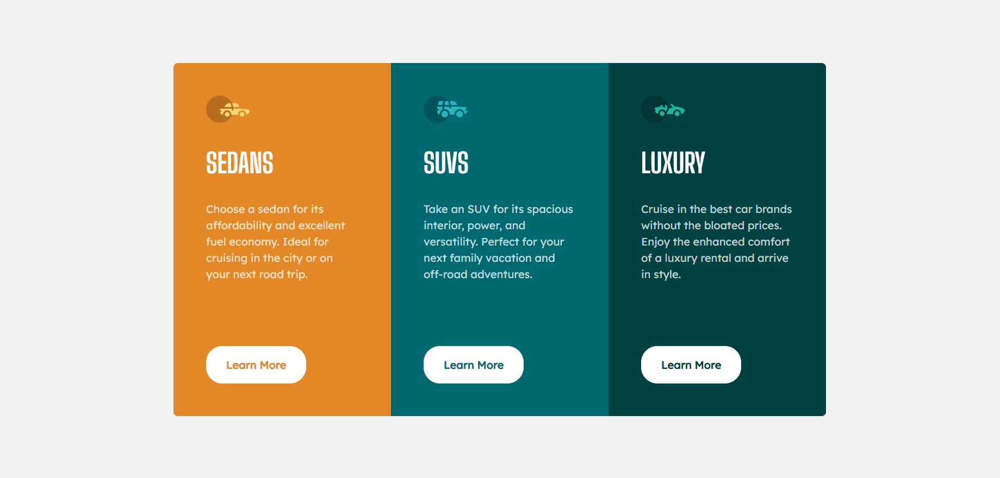

<h1 align="center">3-column preview card component solution
</h1>

  <h3>
    <a href="https://frolicking-donut-cc51a1.netlify.app/" color="white" target="_blank">
      Live
    </a>
     | 
    <a href="https://www.frontendmentor.io/challenges/3column-preview-card-component-pH92eAR2-/hub" target="_blank">
      Solution
    </a>
     | 
    <a href="https://www.frontendmentor.io/challenges/3column-preview-card-component-pH92eAR2-" target="_blank">
      Challenge
    </a>
  </h3>
   Created by David Pelo
  <h4>
    <a href="https://www.davidpelo.com" color="white" target="_blank">
      Website
    </a>
     | 
    <a href="https://www.frontendmentor.io/profile/DavidPelo" target="_blank">
      Frontend Mentor
    </a>
  </h4>

  

### The challenge

Users should be able to:

- View the optimal layout for the app depending on their device's screen size
- See hover states for all interactive elements on the page

### Built With

- HTML5
- CSS3
- Flexbox
- Mobile-first design

### What I learned

This was great practice for some simple flexbox layout practice.