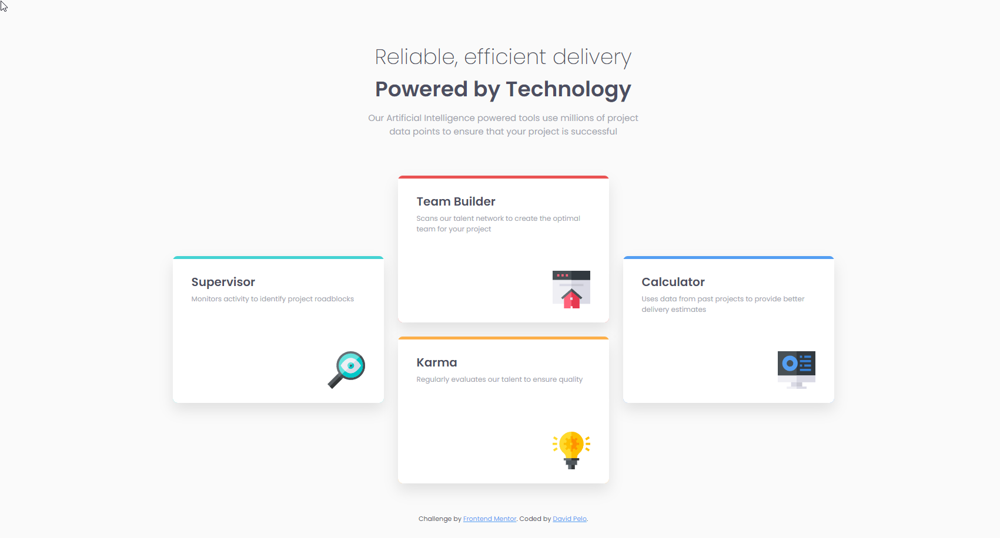

<h1 align="center">Four Card Feature Section Solution
</h1>

  <h3>
    <a href="https://splendorous-marigold-717216.netlify.app/" color="white" target="_blank">
      Live
    </a>
     | 
    <a href="https://www.frontendmentor.io/solutions/profile-card-component-sZKbDAh5GP" target="_blank">
      Solution
    </a>
     | 
    <a href="https://www.frontendmentor.io/challenges/four-card-feature-section-weK1eFYK" target="_blank">
      Challenge
    </a>
  </h3>
   Created by David Pelo
  <h4>
    <a href="https://www.davidpelo.com" color="white" target="_blank">
      Website
    </a>
     | 
    <a href="https://www.frontendmentor.io/profile/DavidPelo" target="_blank">
      Frontend Mentor
    </a>
  </h4>

  

### Built With

- HTML5
- CSS3
- Flexbox
- Mobile-first design