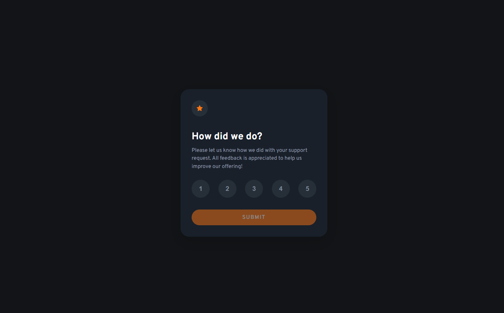

<h1 align="center">Interactive Rating Component
</h1>

  <h3>
    <a href="https://celebrated-cucurucho-a02be0.netlify.app/" color="white" target="_blank">
      Live
    </a>
     | 
    <a href="https://www.frontendmentor.io/solutions/interactive-rating-component-HYs83Y-xy4" target="_blank">
      Solution
    </a>
     | 
    <a href="https://www.frontendmentor.io/challenges/interactive-rating-component-koxpeBUmI" target="_blank">
      Challenge
    </a>
  </h3>
   Created by David Pelo
  <h4>
    <a href="https://www.davidpelo.com" color="white" target="_blank">
      Website
    </a>
     | 
    <a href="https://www.frontendmentor.io/profile/DavidPelo" target="_blank">
      Frontend Mentor
    </a>
  </h4>

  

### The challenge

Users should be able to:

- View the optimal layout for the app depending on their device's screen size
- See hover states for all interactive elements on the page
- Select and submit a number rating
- See the "Thank you" card state after submitting a rating

### Built With

- HTML5
- CSS3
- Flexbox
- Mobile-first design
- Vite
- CSS Modules
- ESLint

### What I learned

This was a really fun project that I used to practice my React.  Another goal of this project was to set up my dev environment using tools like Vite, ESLint, Prettier.

### Useful resources

- [Setup ESLINT and PRETTIER in React app](https://dev.to/knowankit/setup-eslint-and-prettier-in-react-app-357b) - This helped me to configure my environment with ESLint and Prettier.  The linting helped a ton to catch small errors during development.  I will always be using this in the future
- [PerfectPixel](https://chrome.google.com/webstore/detail/perfectpixel-by-welldonec/dkaagdgjmgdmbnecmcefdhjekcoceebi?hl=en) - This is an awesome chrome extension that allows you to provide an image and overlay it on the page you're developing so that you can see exactly what you need to change to get your styles "pixel perfect".
