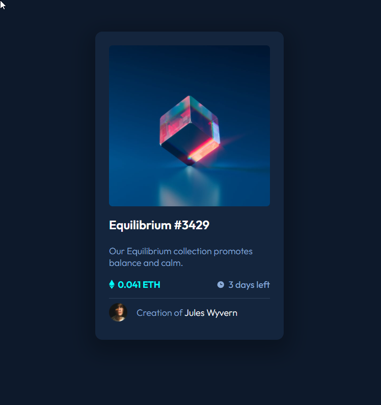
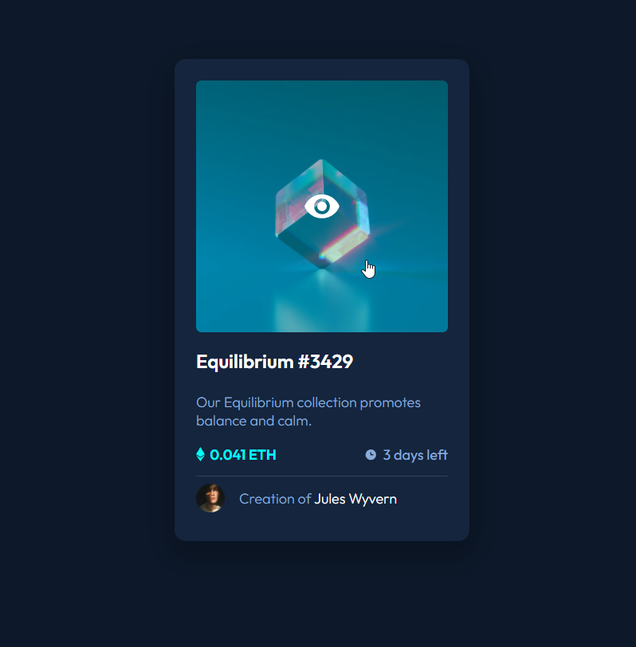

# Frontend Mentor - NFT preview card component solution

This is a solution to the [NFT preview card component challenge on Frontend Mentor](https://www.frontendmentor.io/challenges/nft-preview-card-component-SbdUL_w0U). Frontend Mentor challenges help you improve your coding skills by building realistic projects. 

## Table of contents

- [Frontend Mentor - NFT preview card component solution](#frontend-mentor---nft-preview-card-component-solution)
  - [Table of contents](#table-of-contents)
  - [Overview](#overview)
    - [The challenge](#the-challenge)
    - [Screenshot](#screenshot)
    - [Links](#links)
  - [My process](#my-process)
    - [Built with](#built-with)
    - [What I learned](#what-i-learned)
    - [Useful resources](#useful-resources)
  - [Author](#author)

## Overview

### The challenge

Users should be able to:

- View the optimal layout depending on their device's screen size
- See hover states for interactive elements

### Screenshot




### Links

- Live Site URL: [NFT Preview Card](https://sad-clarke-0a0984.netlify.app/)

## My process

### Built with

- Semantic HTML5 markup
- CSS custom properties
- Flexbox
- Mobile-first workflow

### What I learned

I definitely learned a lot when it came to positioning, this was crucial to making my NFT overlay work on hover. I think it works and looks great!

I primarily used this project as a chance to brush up my pure HTML/CSS skills.

```html
<div class="nft-container">
  <a href="#">
    
    <div class="overlay"></div>
    
  </a>
</div>
```
```css
.overlay {
  background-color: var(--clr-primary-cyan);
  border-radius: 7px;
  opacity: 0;
  top: 0;
  left: 0;
  width: 100%;
  height: 100%;
  position: absolute;
  transition: .5s ease;
}

.overlay-icon {
  opacity: 0;
  position: absolute;
  top: 50%;
  left: 50%;
  transform: translate(-50%, -50%);
  -ms-transform: translate(-50%, -50%);
  transition: .5s ease;
}

.nft-container:hover .overlay {
  opacity: .3;
}

.nft-container:hover img {
  opacity: 1;
}
```

### Useful resources

- [W3Schools](https://www.w3schools.com/howto/howto_css_image_overlay.asp) - Helped with getting the idea of building an overlay.
- [Stack Overflow](https://www.example.com) - Some posts here made position-relative and position-absolute make more sense.

## Author

- Website - [David Pelo](https://www.davidpelo.com)
