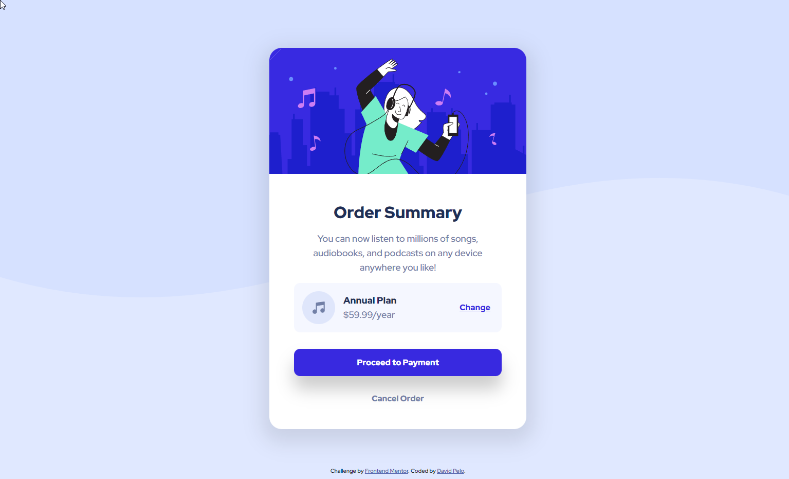

# Frontend Mentor - Order summary card solution

This is a solution to the [Order summary card challenge on Frontend Mentor](https://www.frontendmentor.io/challenges/order-summary-component-QlPmajDUj). Frontend Mentor challenges help you improve your coding skills by building realistic projects. 

## Table of contents

- [Frontend Mentor - Order summary card solution](#frontend-mentor---order-summary-card-solution)
  - [Table of contents](#table-of-contents)
    - [Screenshot](#screenshot)
    - [Built With](#built-with)
    - [Links](#links)
  - [Author](#author)

### Screenshot

### Built With
- HTML5
- CSS3
- Mobile-first design

### Links

- [Solution](https://www.frontendmentor.io/solutions/simple-qr-code-component-CNOuUQmm_X)
- [Live](https://superlative-blini-d10bb1.netlify.app/)

## Author

- Website - [David Pelo](https://www.davidpelo.com)
- Frontend Mentor - [@DavidPelo](https://www.frontendmentor.io/profile/DavidPelo)
