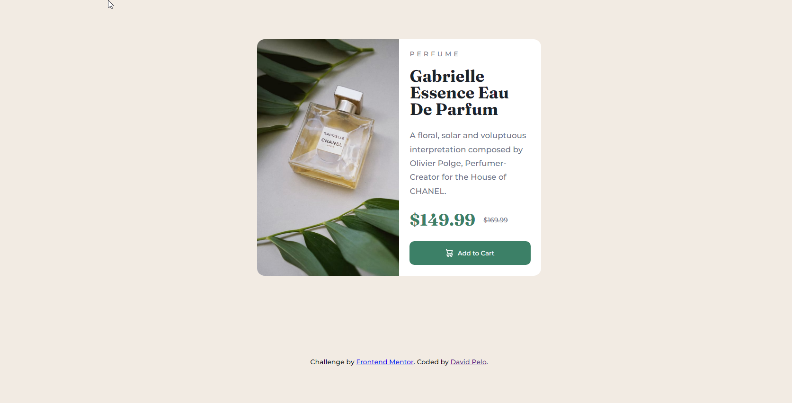

# Frontend Mentor - Product preview card component solution

This is a solution to the [Product preview card component challenge on Frontend Mentor](https://www.frontendmentor.io/challenges/product-preview-card-component-GO7UmttRfa). Frontend Mentor challenges help you improve your coding skills by building realistic projects. 

## Table of contents

- [Frontend Mentor - Product preview card component solution](#frontend-mentor---product-preview-card-component-solution)
  - [Table of contents](#table-of-contents)
  - [Overview](#overview)
    - [The challenge](#the-challenge)
    - [Screenshot](#screenshot)
    - [Links](#links)
  - [My process](#my-process)
    - [Built with](#built-with)
    - [What I learned](#what-i-learned)
    - [Useful resources](#useful-resources)
  - [Author](#author)

**Note: Delete this note and update the table of contents based on what sections you keep.**

## Overview

### The challenge

Users should be able to:

- View the optimal layout depending on their device's screen size
- See hover and focus states for interactive elements

### Screenshot




### Links

- Live Site URL: [Product Preview Card](https://celadon-flan-a0a64a.netlify.app/)

## My process

### Built with

- Semantic HTML5 markup
- CSS custom properties
- Flexbox
- Mobile-first workflow

### What I learned

Using the object-fit property was something new to me

```css
  .desktop-img {
    display: block;
    border-radius: 16px 0px 0px 16px;
    width: 50%;
    object-fit: cover;
  }
```

### Useful resources

- [MDN](https://developer.mozilla.org/en-US/docs/Web/CSS/object-fit) - This helped me with the object-fit property when I was having trouble getting the image to look right in the desktop-view.

## Author

- Website - [David Pelo](https://www.davidpelo.com)
