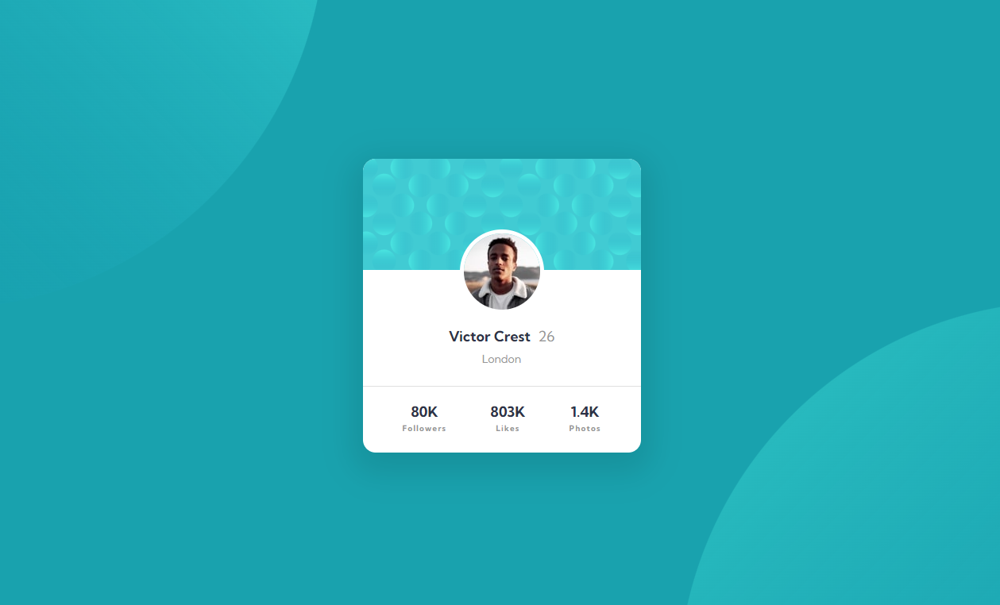

<h1 align="center">Profile card component solution
</h1>

  <h3>
    <a href="https://soft-croissant-3bca36.netlify.app/" color="white" target="_blank">
      Live
    </a>
     | 
    <a href="https://www.frontendmentor.io/solutions/profile-card-component-sZKbDAh5GP" target="_blank">
      Solution
    </a>
     | 
    <a href="https://www.frontendmentor.io/challenges/profile-card-component-cfArpWshJ" target="_blank">
      Challenge
    </a>
  </h3>
   Created by David Pelo
  <h4>
    <a href="https://www.davidpelo.com" color="white" target="_blank">
      Website
    </a>
     | 
    <a href="https://www.frontendmentor.io/profile/DavidPelo" target="_blank">
      Frontend Mentor
    </a>
  </h4>

  

### Built With

- HTML5
- CSS3
- Flexbox
- Mobile-first design

### What I learned

The background images on the body proved to be a bit of a challenge.  This project was great for practicing the background-image and its related properties.