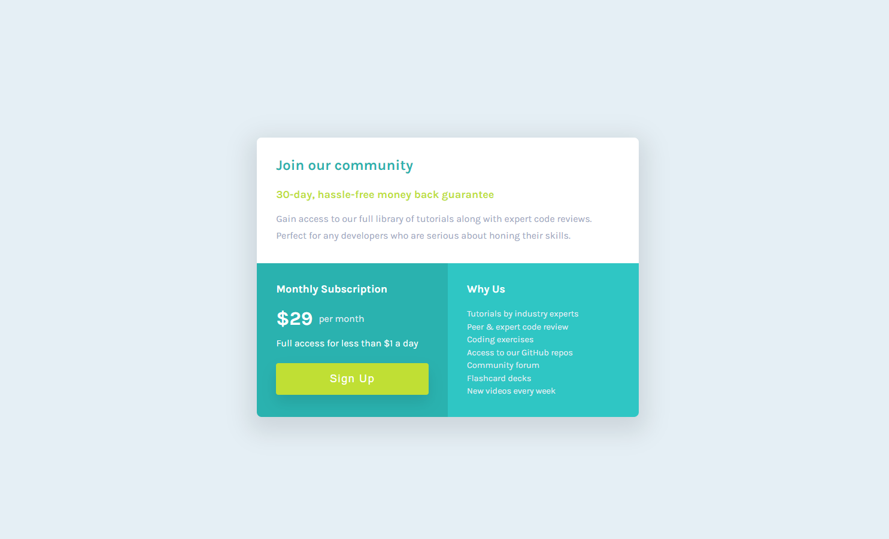

# Frontend Mentor - Single price grid component solution

## Table of contents

- [Frontend Mentor - Single price grid component solution](#frontend-mentor---single-price-grid-component-solution)
  - [Table of contents](#table-of-contents)
    - [Screenshot](#screenshot)
    - [Built With](#built-with)
    - [Links](#links)
  - [Author](#author)

### Screenshot

### Built With
- HTML5
- CSS3
- Flexbox
- Mobile-first design

### Links

- [Solution](https://www.frontendmentor.io/solutions/single-price-grid-component-using-flexbox-qTT_wr3eWc)
- [Live](https://extraordinary-pika-c342fd.netlify.app/)

## Author

- Website - [David Pelo](https://www.davidpelo.com)
- Frontend Mentor - [@DavidPelo](https://www.frontendmentor.io/profile/DavidPelo)
