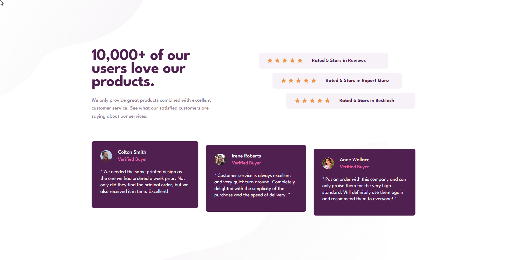

<h1 align="center">Social proof section solution
</h1>

<div align="center">
  <h3>
    <a href="https://dancing-salmiakki-2d3938.netlify.app/" color="white">
      Live
    </a>
    <span> | </span>
    <a href="https://www.frontendmentor.io/solutions/social-proof-section-cGg3VfET_O">
      Solution
    </a>
    <span> | </span>
    <a href="https://www.frontendmentor.io/challenges/social-proof-section-6e0qTv_bA">
      Challenge
    </a>
  </h3>
   Created by David Pelo
  <h4>
    <a href="https://www.davidpelo.com" color="white">
      Website
    </a>
    <span> | </span>
    <a href="https://www.frontendmentor.io/profile/DavidPelo">
      Frontend Mentor
    </a>
  </h4>
</div>
<br><br>

### Built With

- HTML5
- CSS3
- Flexbox
- CSS Grid
- Mobile-first design

### What I learned

This challenge allowed me to practice both page and component layouts.

A main challenge I had to solve was to find a way to create a "hero" in desktop view that would always have consistent margins.

I got the look I was going for by setting position to absolute on the element, and using the margin properties in combination with bottom, top, left, right.

```css
main {
    gap: 3.5rem;
    position: absolute;
    bottom: 0;
    top: 0;
    left: 0;
    right: 0;
    margin-top: 17.5rem;
    margin-bottom: 17.5rem;
    margin-right: auto;
    margin-left: auto;
    max-width: 1110px;
  }
```